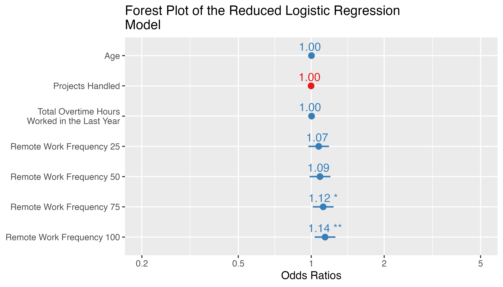
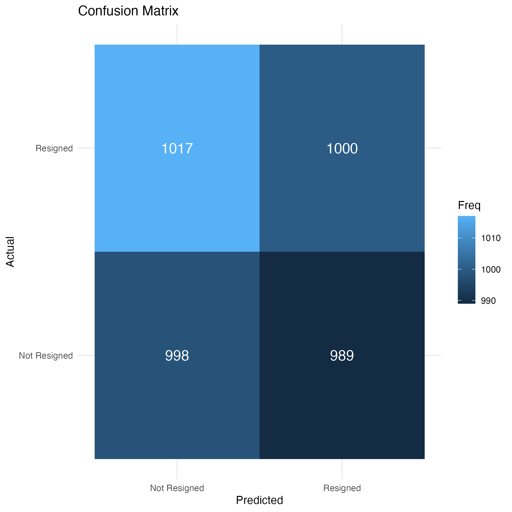
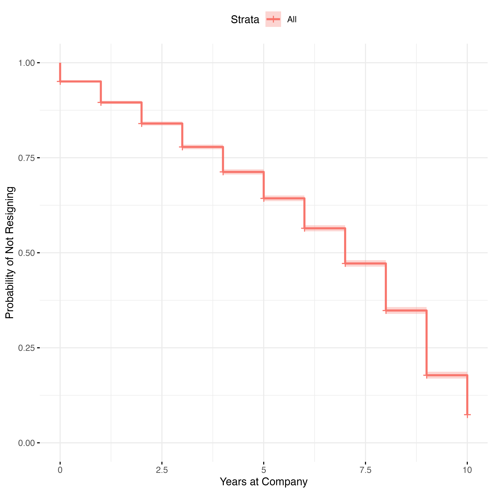
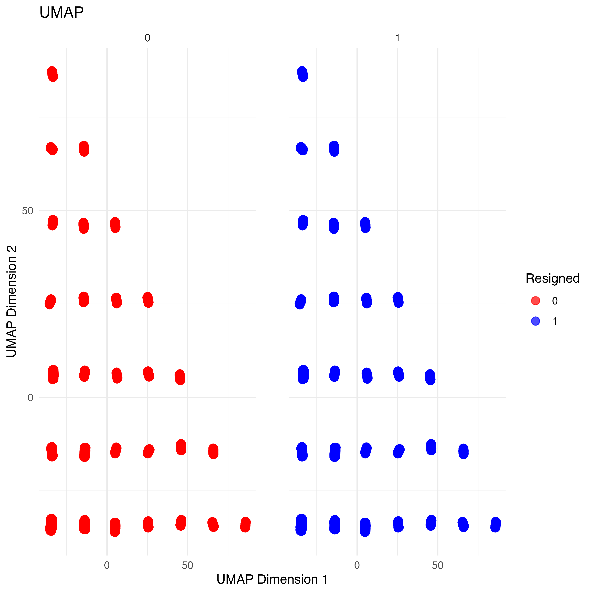

## Introduction
Employee resignation is a critical challenge for organizations, often leading to disruptions in operations, increased recruitment costs, and reduced morale. Understanding the factors that drive resignation, predicting when employees are likely to leave, and identifying patterns within employee groups can empower organizations to take proactive measures to improve retention and foster a productive and supportive work environment.

This project uses the [Employee Performance and Productivity dataset](https://www.kaggle.com/datasets/mexwell/employee-performance-and-productivity-data) offered on Kaggle, which includes detailed metrics such as employee demographics, performance evaluations, satisfaction scores, and work experience.
This dataset contains 100,000 employees and related 20 features (Employee ID, Department, Gender, Age, Job Title, Hire Date, Years at Company, Education Level, Performance Score, Monthly Salary, Work Hours per Week, Projects Handled, Overtime Hours, Sick Days, Remote Work Frequency, Team Size, Training Hours, Promotions, Employee Satisfaction Score, Resigned). For more detailed information about these features, please refer to the [data page](https://www.kaggle.com/datasets/mexwell/employee-performance-and-productivity-data).

The study aims to explore the dynamics of employee resignation.

**Outcome of Interest**: 
- Resign (0: the employee hasn't resigned; 1: the employee has resigned); 
- Years At Company (the number of years the employee has been working for the company)

**Three key questions**:

1.	What feature significantly affects employee resignation?
    
    Approach: Logistic Regression to identify which factors (e.g., satisfaction score, hours worked, etc.) significantly impact resignation.
2.	When will an employee resign, and what factors speed up resignation?
    
    Approach: Apply Cox Proportional Hazards model to predict time-to-resignation and key predictors that accelerate the process.
3.	Are employee groups distinguishable based on resignation?

    Approach: Apply UMAP to reduce dimensionality and cluster employees based on resignation, exploring patterns in these groups.


## Exploratory Analysis

The dataset is highly imbalanced, with 10,010 employees who resigned and 89,990 who did not. To address this imbalance, I sampled 10,010 employees who did not resign and combined them with the 10,010 who did, creating a balanced subset for analysis.

Below is a descriptive summary of each feature by resignation status.

```{r echo=FALSE}
employ_data_sub <-  readRDS("derived_data/employ_data_sub.rds")
# Load the resign_table1 object
table1::table1 (~Department+Gender+Age+Job_Title+Years_At_Company+Education_Level+
          Performance_Score+Monthly_Salary|Resigned, data=employ_data_sub)

table1::table1 (~Work_Hours_Per_Week+Projects_Handled+Overtime_Hours+Sick_Days+Remote_Work_Frequency+Team_Size+
          Training_Hours+Promotions+Employee_Satisfaction_Score|Resigned, data=employ_data_sub)
```

## Logistic Regression

To identify the factors influencing employee resignation, a logistic regression model was employed to assess the effects of Department, Gender, Age, Job Title, Years at Company, Education Level, Performance Score, Monthly Salary, Work Hours per Week, Number of Projects Handled, Overtime Hours, Sick Days, Remote Work Frequency, Team Size, Training Hours, Promotions, and Employee Satisfaction Score. Employee ID and Hire Date were excluded from the analysis.

A final, reduced predictive model was derived using backward variable selection based on the Akaike Information Criterion (AIC) starting from the full model. Results are presented as Odds Ratios.

To evaluate model fit and predictive performance, the dataset was partitioned into training and testing sets at an 80:20 ratio. The model was trained on the training set and subsequently evaluated on the testing set.

### Fitting Results
In the final model, Age, Projects Handled, Overtime Hours, and Remote Work Frequency were retained as predictors. The forest plot below displays the estimated effects and corresponding 95% confidence intervals for these variables, based on the reduced logistic regression model fitted to the training set. Among these factors, only Remote Work Frequency demonstrated a statistically significant association with employee resignation.

```{r echo=FALSE, out.width="70%", fig.align='center'}

```

### Prediction
Below is the confusion matrix for the predictions on the testing set. The model’s performance is extremely poor. Both the recall for the positive class (resigned) and the overall accuracy are around 50%, which is essentially equivalent to random guessing.

```{r echo=FALSE, out.width="50%", fig.align='center'}

```

## Survival Analysis
Given that the dataset includes each employee’s tenure (in years) at the company, employee resignation can be modeled as a time-to-event outcome, with non-resigned employees treated as right-censored observations.

### Kaplan-Meier Surival Plot
Displayed below are the Kaplan–Meier survival curves. Based on these estimates, the median time until resignation is 7 years, with a corresponding 95% confidence interval of 7.00–7.00
```{r echo=FALSE, out.width="70%", fig.align='center'}

```

### Cox Proportional Hazards Model Results

A procedure similar to that used in the logistic regression analysis was employed for the Cox proportional hazards model. After variable selection, only "Projects Handled" remained in the final model. The estimated hazard ratio for this variable is 0.9988, and its 95% confidence interval includes 1, suggesting that its effect on the hazard rate is not statistically significant.

## Dimension Reduction

UMAP was employed to reduce the dataset to a lower-dimensional representation. Prior to this, all categorical variables were converted into dummy variables, resulting in a total of 40 columns. The visualization below shows the UMAP projection. Because the points representing “resigned” and “not resigned” employees overlap substantially in the original plot, separate visualizations for each group are presented to facilitate clearer interpretation.

```{r echo=FALSE, out.width="70%", fig.align='center'}

```


# Summary

The dataset, as provided, does not appear to contain strong or easily identifiable predictors of employee resignation. Although a few factors were initially considered, their effects proved to be statistically weak and offered negligible improvement over random guessing. The absence of meaningful patterns persisted even when approaching the problem from a time-to-event perspective and exploring the data through dimension reduction techniques. Consequently, the findings suggest that either the underlying factors driving employee turnover are not captured by the available features, or more sophisticated modeling techniques and additional data are needed to uncover informative patterns.


